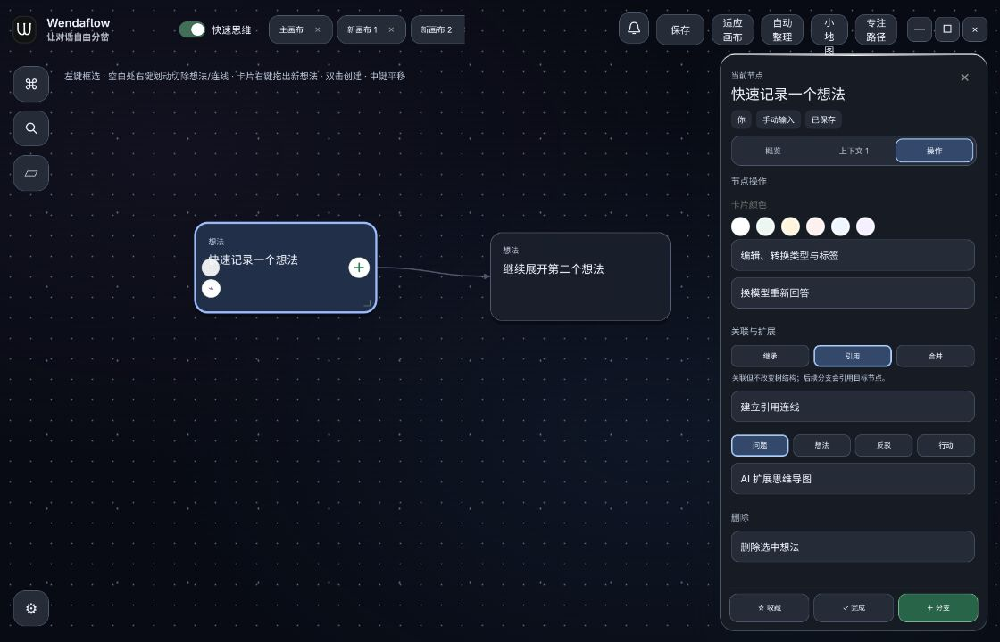

# Wendaflow

> 让对话自由分岔。

## 最新版本：0.2.13

[下载 Linux 版（AppImage / deb）](https://github.com/pyrider3/Wendaflow/releases/tag/v0.2.13)。本次提供 Linux x64 安装包；其他平台旧版见历史 Releases。

- 快速模式右键从 A 拖到 B：A 是父节点，B 成为其子节点；拖到空白处创建 A 的子节点。保存和切换模式后仍为父子关系，引用关系继续用虚线。
- 左键框选碰到卡片即可选中，点击空白处立即取消选择。
- 外观新增「星夜」，并改善夜蓝、墨黑、极夜和星夜的按钮、标签与正文可读性。
- 16 项快速思维测试、524 条翻译审计和 Linux 安装包校验通过。



详见 [快速思维](QUICK_THINKING.md)、[父子连接修复](PARENT_LINKS_0.2.13.md) 和 [界面反馈修复](ISSUES_0.2.9.md)。

人类的真实思考是网状和跳跃的，而目前的 AI 交互被迫变成了单向的线性流。

Wendaflow 是一款把 AI 对话、无限画布、思维导图与本地行动能力融合在一起的桌面软件。它不把思考限制在一条聊天记录中，而是把每一次提问、回答、想法和行动保存为可连接、可回溯、可继续延展的节点。

当你在第十轮对话中发现第二轮的方向更值得继续，只需要回到那个节点创建新分支。原有路径仍完整保留，新路径也不会被淹没。

## 它解决什么问题

普通 AI 聊天是一条线：提问、回答、继续提问。它适合目标明确的任务，却不适合探索、设计、研究、写作和复杂项目。

真实思考会回头、分叉、合并、暂停，并在不同模型与本地任务间切换。Wendaflow 将这种非线性的过程变成可操作的空间：

* 每一轮内容都是节点，而不是不可回头的消息。
* 可从任一历史节点继续，自动继承所需上下文。
* 可并排比较不同模型、不同提示词与不同方案。
* 可把对话转为想法或行动，持续组织为思维网络。

## 核心体验

### 无限画布式 AI 对话

节点位于可缩放、平移的画布中。你可以拖动节点、调整大小、框选多个节点、整理布局，也可以缩小为预览模式，在大量分支中快速找到方向。

节点有三种基本类型：

* **对话**：向云端或本地模型提问并获得回复。
* **想法**：记录无需 AI 回答的灵感、判断和素材。
* **行动**：把任务交给本地 Agent 执行，并保存执行过程与产物。

### 从任何节点重新开始

点击节点旁的加号，或在空白处双击，即可创建新分支。新分支只继承真正需要的祖先上下文，而不是把整张画布不加选择地塞给模型。

发送前，可以在右侧上下文页查看本次请求会带上哪些节点、图片和文件，并临时排除不需要的内容。

### 多模型并存

Wendaflow 不绑定某一家模型服务。你可以同时配置并切换：

* OpenAI Responses 与 OpenAI-compatible 接口
* Anthropic Messages 接口
* Google Gemini 原生接口
* 火山方舟、DeepSeek、豆包等兼容接口
* 本地 Ollama 模型

每个节点会保留所用模型与请求记录，便于回看、对比和复现。

### 图片与文件成为上下文

可以把图片、PDF、PPTX、Word、Excel 等文件附加到节点。它们会随分支进入模型或本地 Agent 的工作上下文，并以文件卡片或图片预览的形式保存在画布中。

WDF 文件可以打包画布结构、节点内容和附件，方便在不同设备之间迁移。

### 本地行动工作台

行动模式可调用本地执行器，例如 Codex、Claude Code 与 DeepSeek Harness。

行动节点不仅显示最终回答，也会记录任务状态、执行事件、终端输出、工作目录变化和生成产物。生成的图片、文档、代码或其他文件会出现在行动节点的“产物”区域，可打开或下载。

## 节点关系与思维导图

除了自然的父子分支，Wendaflow 还支持三类明确关系：

|关系|用途|
|-|-|
|继承|目标节点成为当前节点的子分支，并继承上下文|
|引用|建立关联，但不改变原有树结构|
|合并|将多个节点作为后续分支的组合上下文|

你可以框选节点、连接节点，也可以框选连线后高亮并管理它们。AI 扩展思维导图会从当前节点生成问题、想法、反驳或行动建议；用户确认后才会真正创建节点。

## 日常操作

|操作|说明|
|-|-|
|单击节点|选中节点，打开右侧操作栏|
|双击节点|在节点内部直接编辑标题和正文|
|单击空白处|取消选中并关闭右侧栏|
|双击空白处|从零创建新分支|
|拖动空白处|平移画布|
|鼠标滚轮|缩放画布|
|Shift + 单击|多选节点|
|按住右键拖动|框选节点；若只框到连线则进入连线管理|
|Alt + 拖动节点|连同其子树一起移动|
|Delete|删除选中的节点或连线|
|Ctrl + S|保存当前画布|
|Enter|发送输入内容|
|Shift + Enter|在输入框中换行|

## 数据与保存

* 画布可以保存为本地 .wdf 文件。
* WDF 是可迁移的完整项目文件，包含结构、内容和附件。
* 桌面版默认将应用数据保存在系统文档目录下的 `Wonderful` 文件夹。
* 支持导入、导出、多个画布、画布重命名与已保存画布管理。

## 设计原则

Wendaflow 的目标不是把普通聊天窗口搬到画布上，而是让 AI 成为思维过程中的一个可分叉、可比较、可执行的节点。

* **不丢失路径**：每一个岔路都可以保留。
* **上下文可见**：知道模型到底看到了什么。
* **用户保持控制**：AI 生成建议，是否采用由用户决定。
* **从思考到行动**：想法可以继续转为可执行任务与真实产物。

\---

Wendaflow · WDF  
让对话自由分岔。

## 开源与贡献

Wendaflow 以 [GNU Affero General Public License v3.0](LICENSE) 开源。你可以查看、运行、修改和分发代码，但必须遵守该协议，尤其是向网络用户提供修改版服务时对应的源码提供义务。

欢迎通过 Issue 报告问题或提出建议。准备提交代码前，请阅读 [CONTRIBUTING.md](CONTRIBUTING.md)；构建说明见 [docs/BUILDING.md](docs/BUILDING.md)，安全问题请遵循 [SECURITY.md](SECURITY.md)。

## 快速开始

```bash
npm install
npm run build
npm run desktop:dev
```

源码结构：

- `src/`：React 客户端界面与业务逻辑
- `electron-main.mjs`：Electron 主进程
- `server.mjs`：本地模型代理与桌面辅助服务
- `notification-server/`：通知与授权服务端
- `notification-manager/`：服务端管理软件
- `website/`：Wendaflow 官网静态文件
